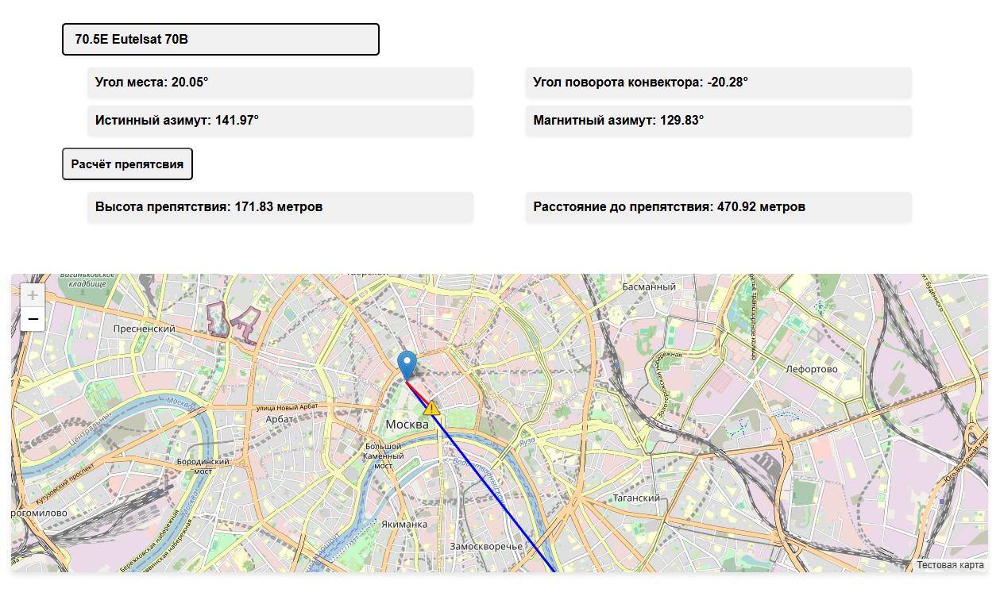

# mapsat-offline-with-docker
Данный проект представялет онлайн/оффлайн сервис для самостоятельной настройки спутниковой антены. Он имеет польностью открытый исходный код, все модули и библиотеки, используемые в нём так же являются открытыми и общедоступными. Если вам понроавилась наша разработка, пожалуйста поддержите нас.

> [!NOTE]
>Необходимо, чтобы на системе, на котрой происходит запуск, был установлен docker. Так же сервис можно использовать без docker, но для этого обязательно нужно установить nodejs
# Запуск приложения через docker
Если у вас нет готовго собранного приложения вам первым делом надо его собрать
> [!NOTE]
> Все команды должны выолняться из папки **maincode**
1. Соберите docker контейнер
`sudo docker build -t mapsat .`
2. Далее необходимо наш собранный конейнер сохранить ввиде **tar** архива
`sudo docker save -o mapsat.tar mapsat`
3. После этого можете запускать приложение двойным нажатием ЛКМ по файлу или run_my_app.sh или `sudo ./run_my_app.sh`
4. После выполнения должен отрыитья *браузер по умолспнию*, где будет запущено приложение. Если этого не происходит, нужно самостоятельно открыть любой браузер и прейти по ссылке <http://localhost:3000/>
> [!NOTE]
> При самсотоятельной сборке контейнера требуется обязательное подключение к интернету, при дальнейшем использовании нет

Если у вас уже есть собранные контейнер в формате **tar** выполняйте пункт 3 и 4, подключение к интернету не требуется
# Запуск приложения без docker
Если у вас нет docler, вы всегда можете использовать наше приложенеи без него. 
Для этого необходимо установить nodejs <https://nodejs.org/en/download/package-manager>
1. Перейдите в папку **maincode**
2. Выполните команду `node server.js`
3. Перейдите по ссылке <http://localhost:3000/>

